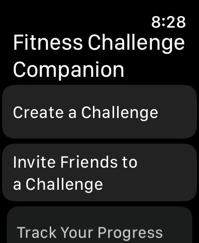
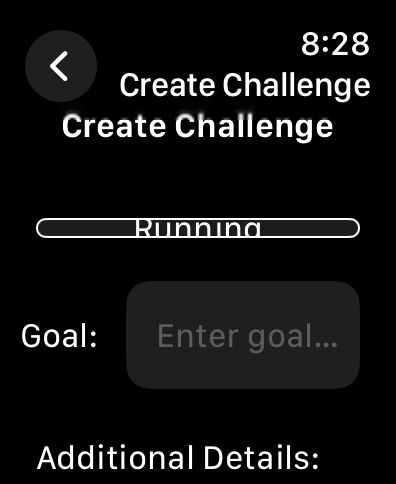
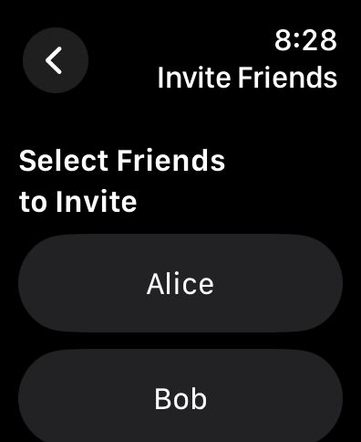
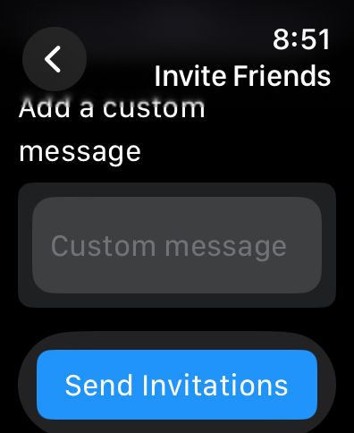
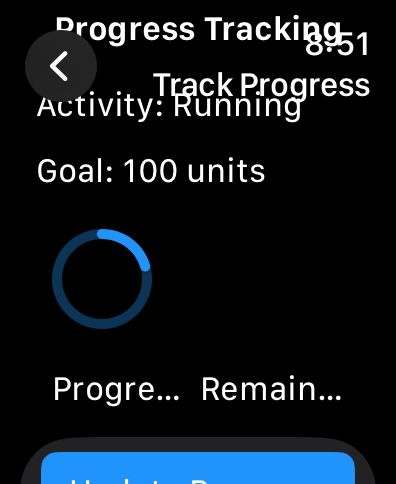
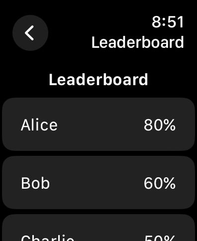
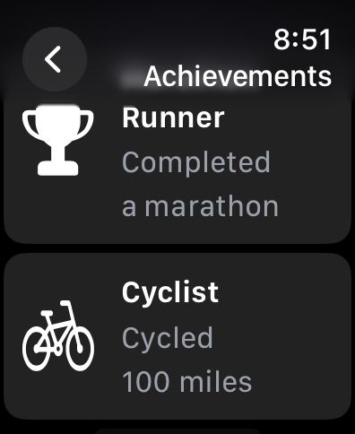
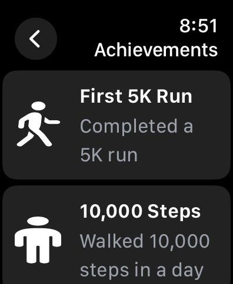

Please go under edit and edit this file as needed for your project.  There is no seperate documentation needed.

# Project Name - Fito 
# Student Id - IT20643522
# Student Name - Weerasinghe M.K.

#### 01. Brief Description of Project - 

The Fito app is a Fitness Challenge Companion designed specifically for the Apple Watch. It enables users to create fitness challenges, invite friends, track progress, view leaderboards, and earn achievements. The app aims to motivate users to achieve their fitness goals through friendly competition and social engagement.

#### 02. Users of the System - 

 - Fitness Enthusiasts: Individuals who regularly engage in fitness activities such as running, cycling, swimming, and walking.
 - Social Exercisers: People who prefer exercising with friends and enjoy the social aspect of fitness.
 - Competitive Users: Individuals who are motivated by competition and enjoy setting and achieving goals.

#### 03. What is unique about your solution -

 - Social Integration: The app emphasizes social engagement by allowing users to create challenges and invite friends, fostering a sense of community.
 - Comprehensive Tracking: Users can track their progress, view leaderboards, and earn achievements, providing multiple forms of motivation.
 - User-Friendly Interface: The app is designed with a simple and intuitive interface, making it easy for users to navigate and use the various features.
 - Customization: Users can create personalized challenges tailored to their specific fitness goals and activities.

   
#### 04. Briefly document the functionality of the screens you have (Include screen shots of images)
1. HomeView

Navigation view with a list of options including creating a challenge, inviting friends, tracking progress, viewing the leaderboard, and viewing achievements.

2. ChallengeCreationView

Allows users to create a fitness challenge by selecting an activity type, setting a goal, and adding additional details.

3. ChallengeInvitationView

Enables users to invite friends to join their fitness challenge.

4. ProgressTrackingView

Provides a visual representation of the user's progress towards their fitness goal.

5. LeaderboardView

Shows a list of participants and their progress in the challenge.

6. AchievementsView

Displays a list of achievements the user has earned.

  
  

#### 05. Documentation 

(a) Design Choices

 - User-Centric Design: Focused on creating an intuitive and seamless user experience.
 - Social Features: Emphasized social engagement through challenges and invitations.
 - Progress Visualization: Provided clear and motivating progress tracking and leaderboards.

   
(b) Why would someone want to invest on your project idea

The fitness and wearable technology markets are rapidly expanding, with increasing demand for fitness tracking and social engagement apps.

(c) Further enhancements you propose

 - Integration with Health Apps: Sync with Apple Health and other fitness apps for comprehensive tracking.
 - Advanced Analytics: Provide users with detailed insights and analytics on their fitness progress.
 - Customizable Workouts: Allow users to create and share custom workout plans.
 - Community Features: Introduce community challenges and forums for broader social engagement.

(d) How would you commercialize this product

 Offer basic features for free and premium features through a subscription model.
 Collaborate with fitness brands and health organizations for promotions and integrations.

#### 06. Reflection

Challenges Faced:
Design Complexity: Balancing a simple and intuitive interface with comprehensive functionality.
Feature Prioritization: Determining which features to implement first to provide maximum value to users.

Approach for Future Assignments:
Conduct thorough user research early in the development process to better understand user needs and preferences.
Work closely with a team of designers, developers, and testers to ensure a high-quality product.

  

